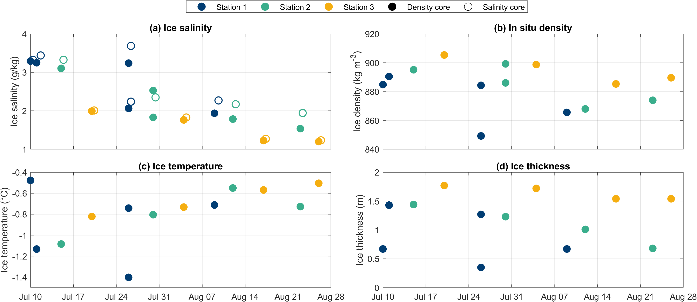

# CONTRASTS Sea-Ice Coring Processing Workflow

[](https://doi.org/10.5281/zenodo.19018446)

**Dmitry Divine, Evgenii Salganik, David Clemens-Sewall, Emiliano Cimoli, Sarah Lena Eggers, Keigo Takahashi, and Marcel Nicolaus (2026)**

MATLAB workflow for processing first- and second-year sea-ice salinity, temperature, and density observations collected at coring sites during the CONTRASTS expedition (PS149) in July–August 2025.

---

## Overview

This repository contains MATLAB scripts used to import, process, quality-control, and export sea-ice coring measurements collected during the CONTRASTS expedition aboard R/V *Polarstern* in July–August 2025.

The workflow reproduces the published salinity, temperature, and density datasets archived at PANGAEA and exports the processed products in MATLAB (`.mat`), Excel (`.xlsx`), and CF-compliant NetCDF (`.nc`) formats.

Sea-ice salinity, temperature, density, thickness, and draft were measured during surveys at coring sites of the CONTRASTS expedition, with four sampling events conducted at each of three different stations. Ice cores were extracted using a 9-cm (Mark II) internal-diameter ice corer (Kovacs Enterprise, USA). The dataset includes observations from 11 coring site visits conducted between 10 July and 26 August 2025, comprising 14 density cores, 13 salinity cores, and 14 temperature cores. Sampling was conducted in the Arctic Ocean between 82.2–85.0°N and 17.9°E to 34.0°W.

Temperature profiles were measured in situ using Testo 720 thermometers inserted into drill holes at 5-cm vertical resolution. Bulk practical salinity was measured from melted 5-cm ice-core sections using a WTW Cond 3110 conductivity meter. Ice density was determined using the hydrostatic weighing method in air and kerosene following Pustogvar and Kulyakhtin (2016). Relative brine and gas volumes were estimated from ice salinity, temperature, and density following Cox and Weeks (1983) and Leppäranta and Manninen (1988).

---

## Associated datasets

### Sea-ice temperature

Divine, D. V.; Salganik, E.; Clemens-Sewall, D.; Cimoli, E.; Eggers, S. L.; Takahashi, K.; Nicolaus, M. (2026):

*First- and second-year sea-ice temperature from the coring sites during the CONTRASTS expedition in July-August 2025.*

PANGAEA. https://doi.pangaea.de/10.1594/PANGAEA.993704

### Sea-ice salinity

Divine, D. V.; Salganik, E.; Clemens-Sewall, D.; Cimoli, E.; Eggers, S. L.; Takahashi, K.; Nicolaus, M. (2026):

*First- and second-year sea-ice salinity from the coring sites during the CONTRASTS expedition in July-August 2025.*

PANGAEA. https://doi.pangaea.de/10.1594/PANGAEA.993703

### Sea-ice density

Divine, D. V.; Salganik, E.; Clemens-Sewall, D.; Cimoli, E.; Eggers, S. L.; Takahashi, K.; Nicolaus, M. (2026):

*First- and second-year sea-ice density from the coring sites during the CONTRASTS expedition in July-August 2025.*

PANGAEA. https://doi.pangaea.de/10.1594/PANGAEA.993687

---

## Original workflow publication

A citable archive of the processing workflow is available on Zenodo:

Salganik, E.; Divine, D. V.; Clemens-Sewall, D.; Cimoli, E.; Eggers, S. L.; Takahashi, K.; Nicolaus, M. (2026):

*Processing script for first- and second-year sea-ice salinity, temperature, and density from the coring sites during the CONTRASTS expedition in July-August 2025.*

https://doi.org/10.5281/zenodo.19018446

---

## Repository structure

```text
data/
├── raw/                    # Original field and laboratory spreadsheets
├── processed/              # Imported MATLAB structures
│   └── core_data_imported.mat
└── final/
    ├── core_data_processed.mat
    ├── core_data_final.xlsx
    └── netcdf/
        ├── Contrasts_coring_density.nc
        ├── Contrasts_coring_temperature.nc
        └── Contrasts_coring_salinity.nc

scripts/
├── a_CONTRASTS_coring_import.m
├── b_CONTRASTS_coring_processing.m
├── c_CONTRASTS_coring_netcdf.m
└── d_Figure_coring_overview.m

analysis/
└── e_bottom_n_sections_latent_density_thickness_vs_time.m

figures/
├── coring_CONTRASTS_overview.png
```

---

## Quick start

From the repository root, run:

```matlab
a_CONTRASTS_coring_import
b_CONTRASTS_coring_processing
c_CONTRASTS_coring_netcdf
d_Figure_coring_overview
```

This reproduces the processed MATLAB, Excel, and NetCDF products and generates the overview figure.

## Workflow

### 1. Import

`a_CONTRASTS_coring_import.m`

* Reads raw Excel files from `data/raw`
* Imports density, temperature, and salinity measurements
* Extracts metadata from workbook sheets
* Associates GPS positions from GPX files
* Creates:

```text
data/processed/core_data_imported.mat
```

### 2. Processing

`b_CONTRASTS_coring_processing.m`

* Matches temperature and density measurements
* Interpolates temperature profiles to density-core depths
* Computes in-situ sea-ice density
* Computes brine and gas volume fractions
* Applies quality-control procedures
* Creates:

```text
data/final/core_data_processed.mat
data/final/core_data_final.xlsx
```

### 3. NetCDF export

`c_CONTRASTS_coring_netcdf.m`

* Converts processed tables to CF-compliant NetCDF files
* Adds variable metadata and global attributes
* Creates:

```text
data/final/netcdf/
├── Contrasts_coring_density.nc
├── Contrasts_coring_temperature.nc
└── Contrasts_coring_salinity.nc
```

---

### 4. Overview figure

`d_Figure_coring_overview.m`

* Imports processed coring products
* Calculates core-averaged salinity, density, temperature, and thickness
* Creates:

```text
figures/coring_CONTRASTS_overview.png
```

## Additional analyses

The `analysis/` directory contains optional scientific analysis scripts that use the processed datasets and NetCDF exports. These scripts are not required to reproduce the published datasets and are intended for downstream analyses and figure generation.

## Requirements

* MATLAB R2023b or newer (recommended)
* NetCDF support included with MATLAB
* Gibbs SeaWater (GSW) Oceanographic Toolbox for MATLAB

---

## Citation

If you use this repository, please cite:

1. The processing workflow publication:
   https://doi.org/10.5281/zenodo.19018446

2. The relevant PANGAEA dataset(s):

   * Density: https://doi.pangaea.de/10.1594/PANGAEA.993687
   * Salinity: https://doi.pangaea.de/10.1594/PANGAEA.993703
   * Temperature: https://doi.pangaea.de/10.1594/PANGAEA.993704

---

## Figure

<p align="center">
  
</p>

**Figure 1.** Temporal evolution of sea-ice salinity, in situ density, temperature, and ice thickness at the CONTRASTS coring stations during July-August 2025.
